# STOREFRONT-NODE-APP

### Overview

The Storefront Node App is similar to Amazon in that you may purchase goods as a customer, or manage goods as a manager or supervisor. Here's an example of how it looks in action: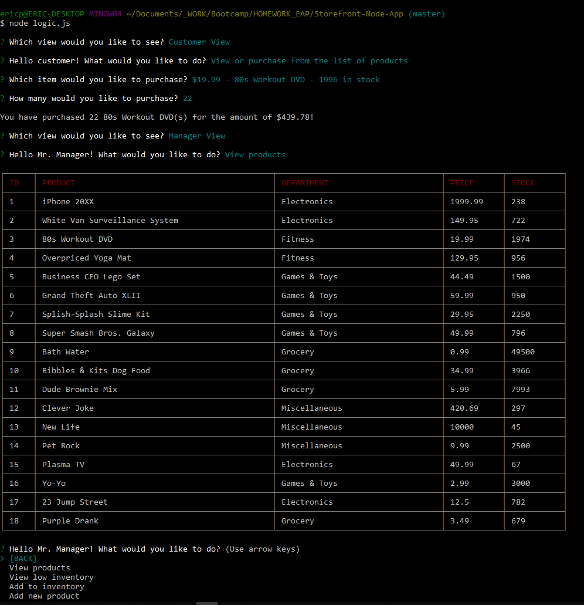

- - -

### How It Works

* Inquirer will prompt the user on which view they would like to see, whether they are a customer, manager or supervisor. Here's what it looks like when first started: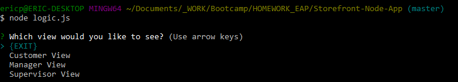

* Once a view is selected, the user will have another set of choices on what they want to do.

* Here's what it looks like for the customer view: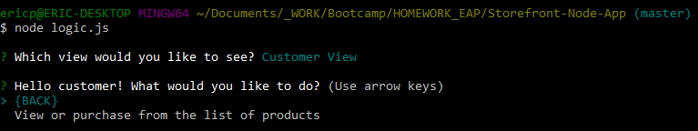

* Here's what it looks like for the manager view: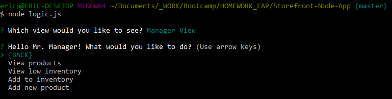

* Note that the supervisor view will be finished at a future date.

* After a choice has been made, each path will either print something out and return to its respective view, or prompt the user for an additional input.

### Commands

The list of commands are as follows...

1. `Customer View`, `View or purchase from the list of products`

    * This command reads the table that has the list of products, then lists it out for the customer to chose something to buy.

    * The list only needs to show the name of the product and the price.

    * Once an item is chosen, it will then prompt the user how many they want to buy. This will calculate their total.

    * If the amount the customer wants is higher than the current stock, they are left with an error message and returned to entering the amount again. Here's an example screenshot of this: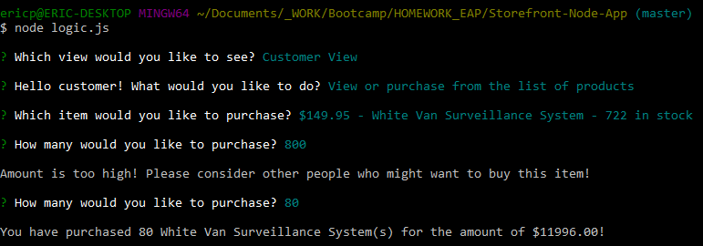

    * Here's an example screenshot of the customer list command: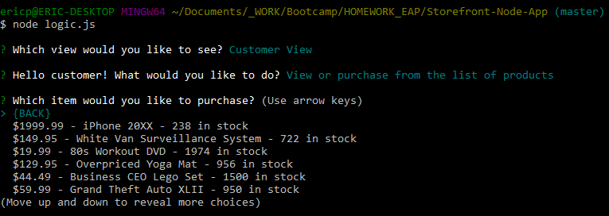

    * Here's an example screenshot of a customer transaction: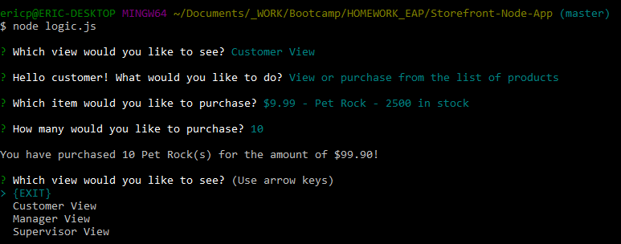

2. `Manager View`, `View products`

    * This command simply prints out a list of all the parameters of every product.

    * The information is gathered from the products table and printed out into a table from the cli-table npm package.

    * Here's an example screenshot of the manager view products command: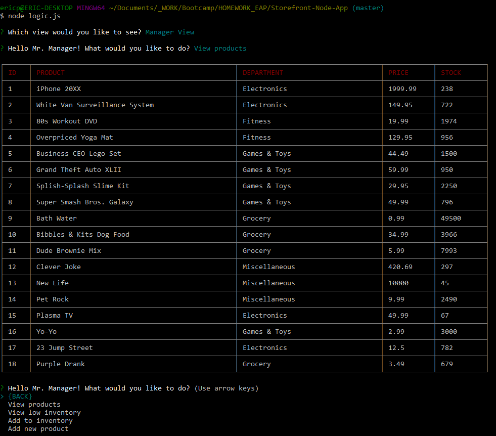

3. `Manager View`, `View low inventory`

    * This command is similar to the last, but prints out any product that has less than 50 stock left.

    * It uses the same table as the last command, but only returns elements that have a stock of 50 or less.

    * Here's an example screenshot of the manager view low inventory command: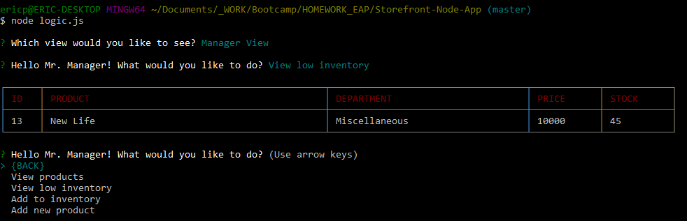Currently, the only thing below 50 is a New Life, so this is all that prints out.

4. `Manager View`, `Add to inventory`

    * This command allows a manager to purchase more stock of existing products.

    * The command will first prompt the user to select an item to restock.

    * Once the item is chosen, the user may input a number to add to the current stock. This number is multiplied by the cost and calculates how much was spent on restocking this product.

    * Here's an example screenshot of the manager add to inventory command: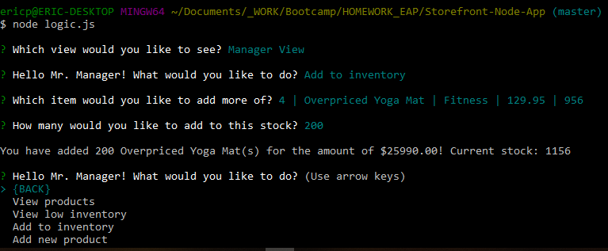

5. `Manager View`, `Add new product`

    * This command allows a manager to create a brand new product from scratch.

    * The user inputs a series of parameters and commits the new product to the list of existing products.

    * Here's an example screenshot of the manager add product command: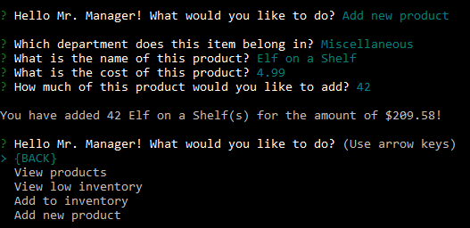

6. `Supervisor View`

    * This command has no real function yet. I plan to add this in a future update. For now, it returns the app back to the view selection.

- - -

### NPM Packages Used

* inquirer - Used to capture input and create lists.

* mysql - Used to read & write to sql databases.

* cli-table - Used to create & populate tables in node.

### Extra Features

* Back command was added so the user doesn't have to restart the app to get back to where they were.

* Exit command was added just in case someone didn't know how to close the connection manually.

* There are checks to make sure the user inputs the correct parameters when specifying an amount (prevents negatives or blanks). Here is an example: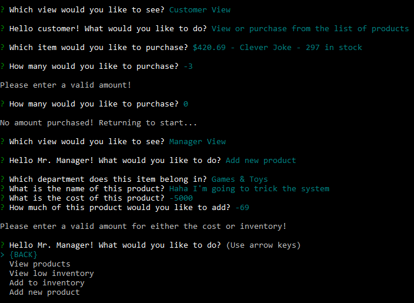

- - -

### Usage

In order to clone and use the app, you need to install the included node_modules in the package.json file. After this, you should be set to run the program in your preferred command window.
